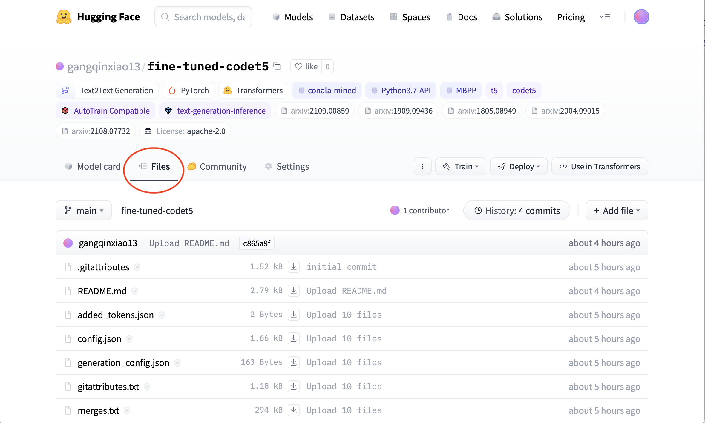

# Code generation -  Generate code examples from natural language queries by Transformer (CodeT5)


## Project description

This project create an application for generating Python code from natural language description by fine-tuning [CodeT5-base](https://huggingface.co/Salesforce/codet5-base).

## Model description

The model is fine-tuned on CodeT5-base to accomplish the transfer-learning downstream task-Python code generation. CodeT5 is a unified pre-trained encoder-decoder Transformer model that better leverages the code semantics conveyed from the developer-assigned identifiers. Comprehensive experiments show that CodeT5 significantly outperforms prior methods on understanding tasks such as code defect detection and clone detection, and generation tasks across various directions including PL-NL, NL-PL, and PL-PL. 

The pre-trained model was introduced in the paper [CodeT5: Identifier-aware Unified Pre-trained Encoder-Decoder Models
for Code Understanding and Generation](https://arxiv.org/abs/2109.00859) by Yue Wang, Weishi Wang, Shafiq Joty, Steven C.H. Hoi and first released in [this repository](https://github.com/salesforce/CodeT5). 

### How to use

Here is how to use this application:

1. Clone this repository using 
```
git clone https://github.com/gangqinxiao13/CodeT5-code-generation.git
```
2. Use this command to install requirements
```
pip install -r requirements.txt
```
3. Download the model files into "final_model" folder from [here](https://huggingface.co/gangqinxiao13/fine-tuned-codet5).

4. Run the app.py
```
python app.py
```
You'll get a link http://127.0.0.1:5000. You'd better use Chrome to open it, then you can use the application.


## Pre-training data

The CodeT5 model was pretrained on CodeSearchNet [Husain et al., 2019](https://arxiv.org/abs/1909.09436). Additionally, the authors collected two datasets of C/CSharp from [BigQuery1](https://console.cloud.google.com/marketplace/details/github/github-repos) to ensure that all downstream tasks have overlapped programming languages with the pre-training data. In total, around 8.35 million instances are used for pretraining ([Wang et al, 2021](https://arxiv.org/abs/2109.00859)).

## Fine-tuning data

The fine-tuned model was trained on conala-mined [Yin et al., 2019](https://arxiv.org/abs/1805.08949), Re-sampled Python3.7 API Knowledge [Xu et al., 2020](https://arxiv.org/abs/2004.09015) and MBPP (Mostly Basic Python Programming) [Austin et al., 2021](https://arxiv.org/abs/2108.07732)
All the data is released in "data" folder.

## Fine-tuning process

You can have a look at the "Finetune_Train.py" to check the code for training process.
This project performs 5 experiments for determining which hyperparameter and the length of input sequence are the best.
The model has the best performance is released on [here](https://huggingface.co/gangqinxiao13/fine-tuned-codet5).
